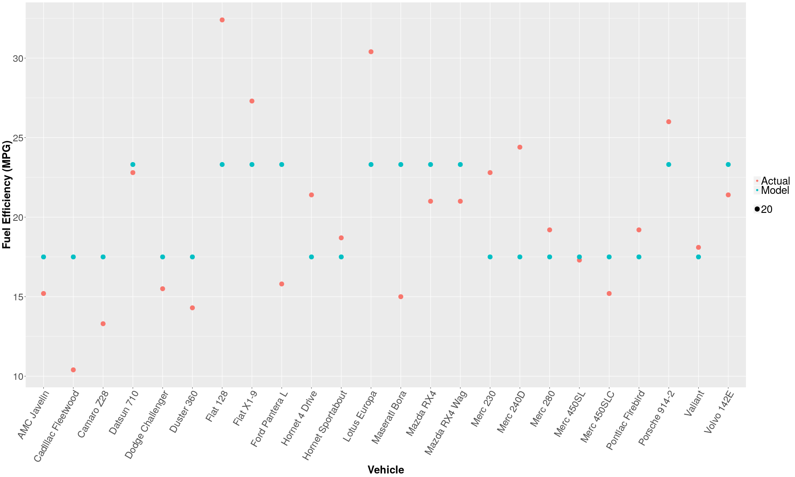

Predicting Fuel Efficiency
========================================================
author: Vanshaj S. • Aug. 4, 2018
width: 1366
height: 768

Introduction
========================================================

The Coursera Johns Hopkins Data Science Specialization contains
nine courses and a capstone project. The seventh course, Regression
Models, contains a project that asks the student to explore the
effect of different variables on the fuel efficiency of the cars in
the  `mtcars` dataset.

The Predicting Fuel Efficiency app, built with Shiny, allows the user
to explore the  `mtcars` dataset by creating linear models of  `mpg`
on the variables selected by the user.

You can check out the app [here](https://vslearns.shinyapps.io/fuelefficiency/) and the source code [here](https://github.com/vslearns/dsc9w4).

What it Does
========================================================

The app splits the  `mtcars` dataset into  `c.train` and  `c.test`.
Once given the variables to use, the app generates (on the same seed)
a linear model relating said variables to the fuel efficiency. The app
then presents a plot of the actual  `c.train` mpg values and the model's
predicted  `c.train` mpg values. You can also check out some highlight
statistics on the model, including the model itself, the r-squared, an
analysis of variance, and a Student's T confidence interval on the
estimates.

Lastly, once you've finished playing around and settled on a model, you
can click on the Test tab to apply said model to the  `c.test` dataset.

Just don't overfit!

Example
========================================================

Suppose the only selected variable is transmission type. Here's the model
that would then be generated.


```r
model <- train(mpg ~ am, data = c.train, method = "lm")
model$finalModel
```

```

Call:
lm(formula = .outcome ~ ., data = dat)

Coefficients:
(Intercept)           am  
      17.50         5.81  
```

Example Continued
========================================================

Here's the generated plot:


